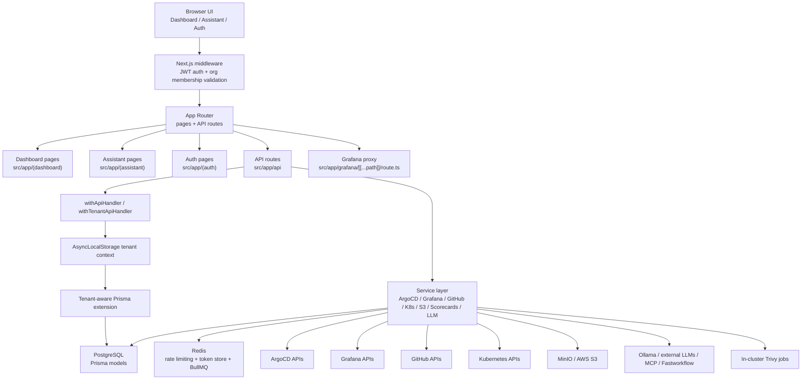

# Current Runtime Architecture Deep Dive

This document describes the active runtime in the current repository state. It is based on the root Next.js application, root Prisma schema, root API routes, Redis/BullMQ support, the production Dockerfile, local `docker-compose.yml`, and `helm/devops-portal/`.

The repository was originally a Backstage app and was rewritten as a Next.js application. Historical Backstage-era source has been removed; this document describes the current Next.js runtime only.

## Scope And Intent

- Audience: engineers maintaining or extending the portal runtime.
- Source of truth: code and active deployment assets.

## Runtime At A Glance

- Web app: root Next.js 15 app under [`src/app`](../../src/app) with 41 dashboard pages and 84 API route handlers.
- UI shell: React 19 + Tailwind + shadcn/ui, with auth, dashboard, and assistant route groups.
- Persistence: Prisma + PostgreSQL 16 via [`prisma/schema.prisma`](../../prisma/schema.prisma).
- Cache and jobs: Redis 7 for rate limiting, encrypted token storage, and BullMQ-backed queues when Redis is present.
- Storage: MinIO/S3 integration via org-scoped encrypted credentials.
- Observability: Prometheus-style metrics at `/api/metrics`, health checks at `/api/health`, optional OpenTelemetry bootstrap via [`instrumentation.ts`](../../instrumentation.ts).
- Deployment: standalone Next.js container via [`Dockerfile`](../../Dockerfile), local infra via [`docker-compose.yml`](../../docker-compose.yml), and Kubernetes packaging via [`helm/devops-portal`](../../helm/devops-portal).

## System Map



## What The Portal Does

The current application is a multi-tenant DevOps operations portal. Its committed runtime centers on:

- Kubernetes and cluster inventory views.
- ArgoCD application visibility and sync operations.
- Grafana dashboard, alert, render, and proxy-backed embedded access.
- GitHub repository, pull request, and Actions views.
- GitOps-oriented repo browsing and bulk workflow surfaces.
- S3/MinIO object browsing and signed URL generation.
- Team, organization, and feature policy management.
- Scorecard evaluation across ArgoCD, DORA, Grafana, GitHub, and security signals.
- Security scanning orchestration using in-cluster Trivy jobs.
- An assistant surface that can answer from a local knowledge base, external LLMs, Ollama, external MCP/Fastworkflow servers, and tool-calling against live portal data.

## Entry Points And Boot Sequence

### App shell

- Root HTML shell is defined in [`src/app/layout.tsx`](../../src/app/layout.tsx).
- There is no root `src/app/page.tsx`; `/` redirects to `/dashboard` in [`next.config.ts`](../../next.config.ts).
- Authenticated dashboard views render through [`src/app/(dashboard)/layout.tsx`](../../src/app/(dashboard)/layout.tsx), which checks `auth()` and mounts the sidebar, header, and assistant dock.
- Organization selection happens client-side in [`src/app/(auth)/select-organization/page.tsx`](../../src/app/(auth)/select-organization/page.tsx), which persists the chosen org in Zustand and a cookie.

### Startup-time server behavior

- Root [`instrumentation.ts`](../../instrumentation.ts) delegates to [`src/lib/instrumentation.ts`](../../src/lib/instrumentation.ts).
- OpenTelemetry starts only when `OTEL_ENABLED=true`.
- In the startup paths inspected here, there is **no discovered runtime reference** to `startWorker()` from [`src/lib/queue.ts`](../../src/lib/queue.ts) or `startCredentialHealthWorker()` from [`src/lib/workers/credential-health-worker.ts`](../../src/lib/workers/credential-health-worker.ts). Queue and credential-health worker code exists, but automatic worker startup is not obvious from the scanned entrypoints.

## Security And Tenancy Flow

### 1. Authentication

Auth is configured in [`src/lib/auth.ts`](../../src/lib/auth.ts).

- Default mode is `keycloak-only`.
- `AUTH_MODE=multi` enables optional providers such as credentials, GitHub, Google, and Azure AD.
- Credentials login stores bcrypt hashes in the `User` model.
- GitHub OAuth access tokens are stored separately in Redis through [`src/lib/token-store.ts`](../../src/lib/token-store.ts), encrypted with AES-256-GCM key-ring support from [`src/lib/encryption.ts`](../../src/lib/encryption.ts).

### 2. JWT membership embedding

During sign-in and periodic refresh, the JWT callback embeds a map of org memberships:

- `token.userId`
- `token.memberships = { [organizationId]: role }`
- `token.membershipsUpdatedAt`

This is important because middleware trusts JWT membership data for fast org validation without a DB lookup on every request.

### 3. Organization selection and request context

The selected org is carried through:

- `organization-id` cookie
- optional `x-organization-id` request header
- JWT membership claims

The client store is defined in [`src/store/organization-store.ts`](../../src/store/organization-store.ts), but security enforcement is server-side, not in Zustand.

### 4. Middleware enforcement

[`src/middleware.ts`](../../src/middleware.ts) is the main security boundary for page and API requests.

- Public paths skip auth.
- Org-optional paths require auth but not org selection.
- Most `/api/*` routes require `x-organization-id` or org cookie plus a matching membership in the JWT.
- On success, middleware injects:
  - `x-organization-id`
  - `x-user-id`
  - `x-user-role`
  - `x-request-id`

The middleware also contains special routing logic for embedded Grafana so root-relative Grafana asset and API requests get rewritten back through `/grafana/*`.

### 5. API wrappers

[`src/lib/api.ts`](../../src/lib/api.ts) provides:

- `withApiHandler` for non-tenant routes.
- `withTenantApiHandler` for org-scoped routes.

The tenant wrapper combines:

- request auth/context setup
- optional role enforcement
- feature gating
- org/user-scoped rate limiting
- audit logging
- Prometheus-style HTTP metrics

### 6. AsyncLocalStorage and Prisma tenant extension

Tenant request context is stored in [`src/lib/tenant-context.ts`](../../src/lib/tenant-context.ts). The Prisma extension in [`src/lib/prisma-tenant.ts`](../../src/lib/prisma-tenant.ts) auto-scopes only these models:

- `Cluster`
- `Deployment`
- `BulkOperation`
- `AuditLog`
- `AlertRule`
- `IntegrationCredential`

This means tenant isolation is strongest when code uses `ctx.db` with those models. It also means tenant protection is **not uniformly centralized** for every org-backed table in the schema. Models such as `SecurityScan`, `Scorecard`, and `ScorecardResult` are organization-scoped in the schema but are not part of the extension's automatic scoping list; routes currently enforce them through explicit `organizationId` filters instead.

## Core Runtime Contracts

### Request-scoped interfaces

| Contract | Purpose | Where enforced |
| --- | --- | --- |
| `x-organization-id` | selects org context for most API routes | middleware + tenant API wrapper |
| `x-user-id` | identifies caller inside handlers | middleware |
| `x-user-role` | allows fast role checks without extra membership query | middleware |
| `organization-id` cookie | persists selected org across page navigation | select-org page + middleware |
| JWT `memberships` map | authorizes org access per request | NextAuth JWT callback + middleware |

### API response envelope

Most API routes use the common response shape from [`src/lib/api.ts`](../../src/lib/api.ts):

```ts
{
  data?: T,
  error?: { code, message, details? },
  meta?: { page?, pageSize?, total? }
}
```

### Feature policy keys

Feature visibility and access are centrally modeled in [`src/lib/features.ts`](../../src/lib/features.ts). Current keys include:

- `repositories`, `pullRequests`, `githubActions`, `gitOpsStudio`
- `monitoring`, `argocd`, `clusters`, `deployments`, `uptimeKuma`, `alerts`
- `storage`, `helm`, `diagrams`, `mcp`, `apiDocs`
- `organizations`, `scorecards`, `credentialHealth`, `team`, `settings`
- `vulnerability` is present but disabled by default

### Organization-backed Prisma models

The current schema models are defined in [`prisma/schema.prisma`](../../prisma/schema.prisma). Major model groups are:

- Identity and tenancy: `Organization`, `Membership`, `User`, `Account`, `Session`, `VerificationToken`
- Operational inventory: `Cluster`, `Deployment`, `AlertRule`
- Async and audit: `BulkOperation`, `AuditLog`
- User/org config: `UserPreference`, `IntegrationCredential`
- Security and maturity: `SecurityScan`, `Scorecard`, `ScorecardRule`, `ScorecardResult`
- `CredentialHealthCheck` model tracks per-credential health probe results

## API Surface By Subsystem

The route tree under [`src/app/api`](../../src/app/api) is broad but consistent. The active runtime is easier to understand by subsystem:

| Subsystem | Representative routes | Backing services / dependencies |
| --- | --- | --- |
| Health and operations | `/api/health`, `/api/metrics`, `/api/openapi`, `/api/features` | health probes, metrics registry, OpenAPI spec, feature policy |
| Organizations and team | `/api/organizations`, `/api/users`, `/api/user-preferences` | Prisma org/user/membership models |
| Clusters and Kubernetes | `/api/clusters/*` | encrypted kubeconfigs, token-generated kubeconfigs, Kubernetes client-node |
| ArgoCD | `/api/argocd/applications/*` | ArgoCD HTTP service using org-scoped credentials |
| Grafana and monitoring | `/api/monitoring/grafana/*`, `/grafana/*` | Grafana REST APIs plus reverse proxy for embedded UI |
| GitHub and GitOps | `/api/github/*`, `/api/gitops/*` | GitHub API, repo tree/content/PR workflow surfaces |
| Storage | `/api/storage/s3` | S3/MinIO signed URL and object listing flows |
| Integrations | `/api/integrations/*` | encrypted org-scoped credentials and settings wiring |
| Assistant and MCP | `/api/mcp/chat` | knowledge base, external MCP/Fastworkflow, Ollama, cloud LLMs, tool-calling |
| Scorecards | `/api/scorecards/*` | DB-backed rules plus ArgoCD/Grafana/GitHub/DORA/security aggregations |
| Security scanning | `/api/security/scans/*` | in-cluster Trivy job creation, polling, and report persistence |
| Queue stats | `/api/queue/stats` | BullMQ queue visibility if Redis is available |

## Service Layer Responsibilities And Dependencies

### DB-backed capabilities

- organizations, users, memberships, feature flags, preferences
- cluster inventory records
- integration credential records
- bulk operation status and audit trails
- security scan records
- scorecards, rules, and cached scorecard results

### External-system adapters

- [`src/lib/services/argocd.ts`](../../src/lib/services/argocd.ts) resolves org-scoped ArgoCD credentials and wraps the ArgoCD API.
- [`src/lib/services/grafana.ts`](../../src/lib/services/grafana.ts) resolves Grafana credentials from integration records, org settings, or env fallback.
- [`src/lib/services/kubernetes.ts`](../../src/lib/services/kubernetes.ts) decrypts or generates kubeconfigs, then instantiates Kubernetes API clients.
- GitHub routes and tools depend on per-user or org-scoped GitHub access through the GitHub integration layer.
- [`src/lib/services/s3.ts`](../../src/lib/services/s3.ts) fronts MinIO/AWS S3 for listing and signed URL generation.
- [`src/lib/services/security-scans.ts`](../../src/lib/services/security-scans.ts) creates Kubernetes jobs to run Trivy scans.

### Credential sourcing model

The repo uses more than one credential pattern:

- Org-scoped encrypted credentials in `IntegrationCredential` for ArgoCD, Grafana, GitHub PATs, LLMs, Uptime Kuma, Supabase, S3, and related providers.
- Per-user encrypted tokens in Redis for OAuth-style token storage, notably GitHub.
- Legacy org `settings` JSON as a fallback in some services.
- Process env fallback for some integrations and operational endpoints.

The result is flexible, but not fully normalized. Some integrations still have multiple possible sources of truth.

## Assistant And MCP Runtime

The assistant UI lives in [`src/app/(assistant)/assistant/page.tsx`](../../src/app/(assistant)/assistant/page.tsx) and the dock UI mounts from the dashboard shell.

The backend route [`src/app/api/mcp/chat/route.ts`](../../src/app/api/mcp/chat/route.ts) supports several paths:

- `preferredSource=mcp`: call an external MCP server URL with SSRF protections.
- `preferredSource=fastworkflow`: call a configured external tool endpoint.
- `preferredSource=ollama`: call an Ollama-compatible endpoint directly.
- `preferredSource=tools`: use Ollama function calling plus live portal tools.
- `preferredSource=llm`: use organization-configured cloud LLM credentials.
- `preferredSource=knowledge`: answer from a local knowledge base.
- `preferredSource=auto`: try fastworkflow, then Ollama, then configured LLM, then knowledge lookup.

This route is tenant-scoped and also requires the `mcp` feature to be enabled.

## Grafana Embedding And Proxying

Grafana is not just a set of REST calls.

- [`src/app/grafana/[[...path]]/route.ts`](../../src/app/grafana/[[...path]]/route.ts) proxies the embedded Grafana SPA through the portal.
- It strips portal cookies before proxying upstream and injects the org-selected Grafana API key.
- It rewrites HTML, `/bootdata`, redirects, and some headers so Grafana behaves as if it lives under `/grafana`.
- [`src/middleware.ts`](../../src/middleware.ts) complements this by rewriting root-relative Grafana SPA requests back under `/grafana/*`.

This is one of the more specialized parts of the runtime because it mixes auth, proxying, and UI embedding behavior.

## Deployment And Operational Interfaces

### Local development

[`docker-compose.yml`](../../docker-compose.yml) brings up:

- PostgreSQL 16
- Redis 7
- MinIO
- optional Redis Commander and pgAdmin

The app itself is expected to run separately through `npm run dev`.

### Container build

[`Dockerfile`](../../Dockerfile) builds the root Next.js app, runs `prisma generate`, and ships a standalone Next.js server image. It assumes:

- Node 22 at build and runtime
- runtime secrets injected externally
- `/api/health` as container health check

### Helm chart

[`helm/devops-portal/Chart.yaml`](../../helm/devops-portal/Chart.yaml) and [`helm/devops-portal/values.yaml`](../../helm/devops-portal/values.yaml) package the active runtime, not the Backstage-era packages.

Default Helm dependencies include:

- PostgreSQL
- Redis
- MinIO
- optional Sealed Secrets controller
- optional Trivy Operator

The chart also defines:

- ingress
- probes against `/api/health`
- autoscaling
- pod security context
- secret sourcing patterns for Sealed Secrets, External Secrets Operator, and Secrets Store CSI

### Operational endpoints

| Endpoint | Auth expectation | Notes |
| --- | --- | --- |
| `/api/health` | public; verbose mode requires token in production | checks DB, Redis, queue, auth config, and optionally env-based ArgoCD/Grafana |
| `/api/metrics` | bearer token required in production when `METRICS_AUTH_TOKEN` is set; otherwise 503 in prod | exposes Prometheus text metrics |
| `/api/features` | org membership required | returns policy, per-user overrides, and effective feature access |
| `/api/openapi` | route is simple, but middleware still makes it org-scoped | returns static OpenAPI JSON |
| `/api/mcp/chat` | org membership + `mcp` feature required | assistant orchestration entrypoint |

## Implemented Versus Partial Behavior

### Clearly implemented and active

- Next.js dashboard/auth/assistant shells
- multi-tenant auth and middleware enforcement
- Prisma schema and DB-backed org/team/config models
- cluster, ArgoCD, Grafana, GitHub, S3, scorecard, and security-scan route families
- metrics and health endpoints
- Grafana embedded proxy path

### Present but partial or inconsistent

- [`src/lib/queue.ts`](../../src/lib/queue.ts) contains TODO placeholders for actual bulk GitHub updates, ArgoCD sync execution, and deployment restarts inside worker processors.
- Worker startup wiring is not obvious from the scanned runtime entrypoints.
- Security and scorecard models are org-scoped in the schema but not covered by the Prisma tenant extension's automatic model list.
- Some services still use org settings or env fallback in addition to encrypted integration records, so credential ownership is not fully unified.

## Risk Notes

- **Tenant isolation is strong but not completely uniform.** Middleware, JWT membership checks, and the Prisma extension form a solid base, but some org-scoped models are enforced by route-level filters rather than the extension itself.
- **Background work may look more complete than it is.** Queue infrastructure, stats, and health checks exist, but worker execution paths still contain TODO placeholders and discovered startup wiring is incomplete.
- **Integration configuration is flexible but fragmented.** Some services can source credentials from encrypted DB records, org settings, or env vars, which increases fallback complexity and configuration drift risk.
- **Documentation may lag code in pre-1.0 releases.** When in doubt, the source under `src/` is authoritative.

## Verification Limits

This document is code-grounded but not runtime-verified in the current shell session.

- `node` and `npm` are not installed in the shell used for this analysis.
- `lint`, `typecheck`, tests, and a local app startup check could not be executed here.
- No live calls to external integrations were performed in this pass.

For follow-up work, the next high-value step is to validate this document against a real startup path: install Node, run the app locally, confirm which routes render successfully, and verify whether any workers start automatically in the deployed environment.
