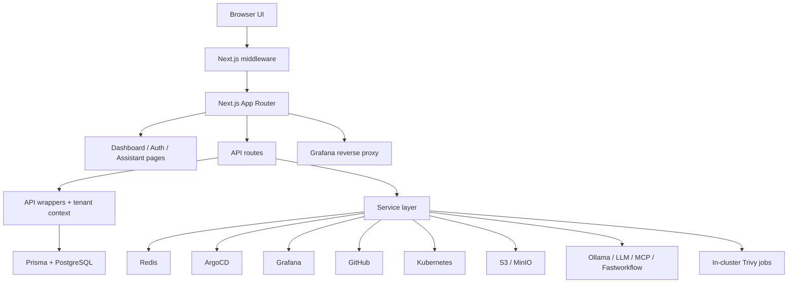

# DevOps Portal Current Runtime Architecture

This version is formatted for direct paste into Notion. It avoids repo-relative links and keeps the structure simple.

## Summary

The active application in this repository is a root-level Next.js 15 portal using React 19, Prisma, PostgreSQL, Redis, and a set of external DevOps integrations. It is not the older Backstage package/plugin layout that still exists elsewhere in the repo.

The current runtime is organized around:

- a dashboard UI
- tenant-aware API routes
- org-scoped encrypted integration credentials
- Prisma-backed operational state
- external adapters for ArgoCD, Grafana, GitHub, Kubernetes, S3, and optional LLM/MCP systems

## Scope

This architecture summary is based on the current root runtime:

- `src/app`
- `src/lib`
- `prisma/schema.prisma`
- `Dockerfile`
- `docker-compose.yml`
- `helm/devops-portal`

Legacy directories such as `packages/`, `plugins/`, and older Backstage-oriented docs/workflows are historical context only.

## Runtime Topology



## What The Portal Does

The current portal provides:

- dashboard summaries and recent activity
- cluster and Kubernetes visibility
- ArgoCD application listing and sync actions
- Grafana dashboard, alert, render, and embedded UI access
- GitHub repository, PR, and Actions views
- GitOps-oriented repo and branch workflows
- S3/MinIO object browsing and signed URL generation
- organization, team, role, and feature-policy management
- scorecard evaluation using multiple data sources
- security scan orchestration using Kubernetes jobs
- an assistant surface that can answer via knowledge base, Ollama, cloud LLMs, external MCP/Fastworkflow servers, and live tool-calling

## Security And Tenancy Model

### Authentication

Auth is implemented with NextAuth.

- default mode is `keycloak-only`
- `AUTH_MODE=multi` enables additional providers such as credentials, GitHub, Google, and Azure AD
- credentials auth stores bcrypt hashes in the `User` table
- GitHub OAuth tokens are stored separately in Redis using encrypted token storage

### Organization access

The selected org is carried through:

- `organization-id` cookie
- optional `x-organization-id` request header
- JWT membership claims

Middleware validates:

- the user is authenticated
- the requested org exists in the JWT membership map
- the request receives injected headers:
  - `x-organization-id`
  - `x-user-id`
  - `x-user-role`
  - `x-request-id`

### Tenant-safe route handling

Tenant routes use an API wrapper that provides:

- request-scoped tenant context
- role checks
- feature gating
- rate limiting
- audit logging
- request metrics

Tenant context is stored with AsyncLocalStorage and used by the Prisma tenant extension.

## Important Runtime Contracts

### Request-scoped interfaces

- `x-organization-id`: selects org context
- `x-user-id`: current user identifier
- `x-user-role`: role for fast authorization checks
- JWT `memberships`: org-to-role map used by middleware
- `organization-id` cookie: last selected org

### API response shape

Most API routes return:

```json
{
  "data": {},
  "error": {
    "code": "ERROR_CODE",
    "message": "Human-readable message",
    "details": {}
  },
  "meta": {
    "page": 1,
    "pageSize": 20,
    "total": 20
  }
}
```

### Feature policy keys

Feature access is modeled centrally. Current keys include:

- repositories
- pullRequests
- githubActions
- gitOpsStudio
- monitoring
- argocd
- clusters
- deployments
- uptimeKuma
- alerts
- vulnerability
- storage
- helm
- diagrams
- mcp
- apiDocs
- organizations
- scorecards
- credentialHealth
- team
- settings

## Data Model

The main Prisma model groups are:

- Identity and org tenancy:
  - Organization
  - Membership
  - User
  - Account
  - Session
  - VerificationToken
- Operational inventory:
  - Cluster
  - Deployment
  - AlertRule
- Audit and async state:
  - BulkOperation
  - AuditLog
- Config and preferences:
  - UserPreference
  - IntegrationCredential
- Security and maturity:
  - SecurityScan
  - Scorecard
  - ScorecardRule
  - ScorecardResult

## API Surface By Subsystem

The current route tree is broad. The easiest way to understand it is by subsystem:

- Health and operations
  - `/api/health`
  - `/api/metrics`
  - `/api/openapi`
  - `/api/features`
- Organizations and users
  - `/api/organizations`
  - `/api/users`
  - `/api/user-preferences`
- Clusters and Kubernetes
  - `/api/clusters/*`
- ArgoCD
  - `/api/argocd/applications/*`
- Grafana and monitoring
  - `/api/monitoring/grafana/*`
  - `/grafana/*`
- GitHub and GitOps
  - `/api/github/*`
  - `/api/gitops/*`
- Storage
  - `/api/storage/s3`
- Integrations and credentials
  - `/api/integrations/*`
- Assistant and MCP
  - `/api/mcp/chat`
- Scorecards
  - `/api/scorecards/*`
- Security scanning
  - `/api/security/scans/*`
- Queue stats
  - `/api/queue/stats`

## Service Layer Responsibilities

### Primarily DB-backed

- organizations, users, memberships, feature flags
- cluster inventory
- integration credential records
- audit logs and bulk operation records
- security scan records
- scorecards and cached scorecard results

### Primarily external-integration backed

- ArgoCD service
- Grafana service
- Kubernetes service
- GitHub integration service
- S3/MinIO service
- assistant/LLM tooling

### Credential sourcing model

The current runtime uses multiple credential sources:

- encrypted org-scoped credentials in the database
- per-user encrypted tokens in Redis
- org settings JSON fallback in some services
- environment variable fallback in some services

This works, but it is not fully normalized.

## Deployment Model

### Local development

`docker-compose.yml` starts:

- PostgreSQL 16
- Redis 7
- MinIO
- optional Redis Commander
- optional pgAdmin

The app itself runs separately via `npm run dev`.

### Production container

The root `Dockerfile` builds and ships the current Next.js runtime as a standalone server image.

It assumes:

- Node 22
- runtime secrets injected externally
- `/api/health` for health checks

### Helm packaging

`helm/devops-portal` packages the active runtime and can optionally install:

- PostgreSQL
- Redis
- MinIO
- Sealed Secrets controller
- Trivy Operator

## Operational Endpoints

- `/api/health`
  - public by default
  - verbose mode requires auth token in production
  - checks DB, Redis, queue state, auth config, and optionally env-based integrations

- `/api/metrics`
  - bearer token required in production when metrics auth is configured
  - returns Prometheus-formatted metrics

- `/api/features`
  - tenant-aware
  - returns effective feature access for the current user and org

- `/api/openapi`
  - returns static OpenAPI JSON

- `/api/mcp/chat`
  - tenant-aware
  - requires the `mcp` feature
  - supports knowledge, LLM, Ollama, tool-calling, and external MCP/Fastworkflow routing

## Current Risks And Gaps

- tenant isolation is strong but not fully centralized because the Prisma tenant extension only auto-scopes a subset of org-backed models
- worker startup is not obvious from the scanned runtime entrypoints
- BullMQ worker handlers still contain TODOs for some real execution paths
- credential configuration can come from DB records, org settings, or env vars
- several docs and workflows are still Backstage-era and can mislead maintainers

## Local Worktree Note

At the time of this summary, the local worktree also contains an uncommitted credential-health feature slice with:

- schema additions
- dashboard UI
- API routes
- metrics
- a worker

That feature is not part of committed `HEAD` and looked mid-implementation during static inspection.

## Verification Limits

This summary is based on static repo inspection.

- `node` and `npm` were unavailable in the current shell
- build, lint, typecheck, tests, and runtime startup were not re-verified
- no live integration calls were performed
